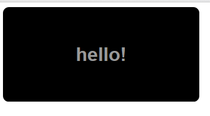
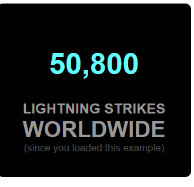
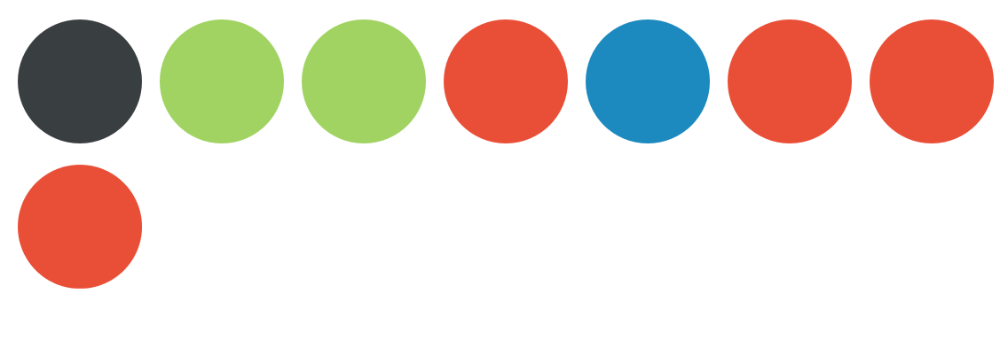
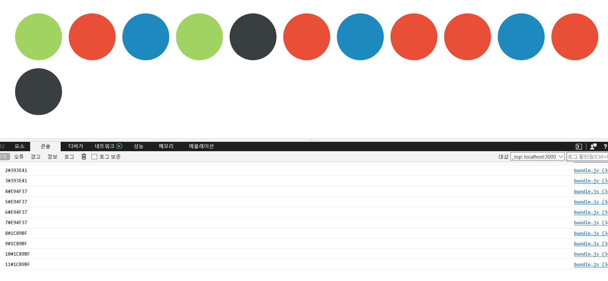

# 상태다루기
------
*속성* : 한번 설정되면 변하지 않음 
*state* : 속성의 수준을 넘어 컴포넌트에 데이터를 저장하는 다른 방법

* 상태에 대한 모든 사항
* 상태 보존 컴포넌트

-------

<pre><code>
    import React, { Component } from 'react';

    class App extends Component {
    render() {
        var divStyle ={
        width:250,
        textAlign:"center",
        backgroundColor:"black",
        padding: 40,
        fontFamily: "sans-serif",
        color: "#999",
        borderRadius: 10
        };
        return (
        &lt;div style={divStyle}&gt;&lt;LightningCounter/&gt;&lt;/div&gt;
        );
    }
    }

    class LightningCounter extends Component{
    render () {
        return (
            &lt;h1&gt;hello!&lt;/h1&gt;
        );
    }
    }

    export default App;

</pre></code>
        

-------
#### getInitialState
이 메소드는 컴포넌트가 마운트되기 전에 실행되며 컴포넌트의 state 객체를 변경할 수 있게 해준다
constructor로 대신한다.

#### componentDidMount
이 메소드는 컴포넌트가 렌더링(또는 마운트)된 후에 실행된다.

#### setState
이 메소드는 state 객체의 값을 갱신할 수 있게 해준다.

-----
<pre><code>
    class LightningCounter extends Component{
    //state 객체의 값 초기화
    constructor(){
        super();
        this.state={
        strikes:0
        };
    }
    render () {
        return (
            &lt;h1&gt;{this.state.strikes}&lt;/h1&gt;
        );
    }
    }
</pre></code>
------

------
<pre><code>
    class LightningCounter extends Component{
    //state 객체의 값 초기화
    constructor(){
        super();
        this.state={
        strikes:0
        };
    }
    
    //arrow function  사용 -> this를 자동으로 받아줌
    timerTick= () =>{
        this.setState({
        strikes:this.state.strikes+100
        });
    }

    //타이머를 통하여 초마다 100씩 증가
    componentDidMount(){
        //setInterval(this.timerTick.bind(this),1000);
        setInterval(this.timerTick,1000);
    }

    render () {
        return (
            &lt;h1&gt;{this.state.strikes}&lt;/h1&gt;
        );
    }
    }
</pre></code>

-------

_setState를 통해 state 객체에 내용이 변경될 때마다 render메소드가 자동으로 호출된다_
=> 리액트만의 작동방식 : 데이터와 UI의 동기화를 유지하는 일

#데이터에서 UI로

데이터는 json 객체, 배열 등등의 형태를 가진다.
---------
<pre><code>
    class App extends Component {
    render() {
        var circleStyle={
        margin:10,
        padding:20,
        display: "inline-block",
        backgroundColor: this.props.bgColor,
        borderRadius: "50%",
        width:100,
        height:100,
        };
        
        return (
        &lt;div style={circleStyle}&gt;
        &lt;/div&gt;
        );
    }
    }
</pre></code>

render 메소드에서 컴포넌트의 동작에 영향을 주는 데이터를 다룰 경우에 제약이 따른다.
<pre><code>
    var theCircle=&lt;App bgColor="#F9C240"/&gt;
    ReactDOM.render(&lt;div&gt;{theCircle}&lt;/div&gt;, document.getElementById('root'));

    function showCircle(){
    var colors=["#393E41","#E94F37","#1C89BF","#A1D363"];
    var ran=Math.floor(Math.random()*colors.length);
    return &lt;App bgColor={colors[ran]}/&gt;;
    }
    ReactDOM.render(&lt;div&gt;{showCircle()}&lt;/div&gt;, document.getElementById('root'));

    var colors=["#393E41","#E94F37","#1C89BF","#A1D363"];
    function showCircle(){
        
        var ran=Math.floor(Math.random()*colors.length);
        return &lt;App bgColor={colors[ran]}/&gt;;
    }

    // 배열을 만들어서 배열에 컴포넌트를 집어넣은 후 rendering이 가능하다
    var cirArr=[];
    for(var i=0;i&lt;colors.length*3;i++){
        cirArr.push(showCircle(i));
    }
    ReactDOM.render(&lt;div&gt;{cirArr}&lt;/div&gt;, document.getElementById('root'));

</pre></code>
이런 방법으로 컴포넌트를 인스턴스화 시킨 JSX를 만든다. 유연성을 이용하여 많은 일이 가능하다.

<pre><code>
    var colors=["#393E41","#E94F37","#1C89BF","#A1D363"];
    function showCircle(i){
        var ri=Math.floor(i/4);
        var ran=Math.floor(Math.random()*colors.length);
        var color=colors[ri];
        return &lt;App key={i+color} bgColor={colors[ran]}/&gt;;
    }

    var cirArr=[];
    for(var i=0;i&lt;colors.length*3;i++){
        cirArr.push(showCircle(i));
        console.log(cirArr[i]);
        
    } 
    

    ReactDOM.render(&lt;div&gt;{cirArr}&lt;/div&gt;, document.getElementById('root'));

</pre></code>

